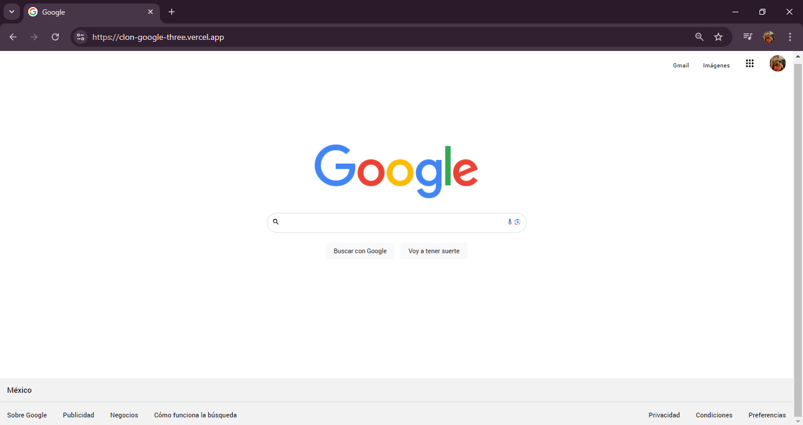

# Clon de Google hecho en TECNOLOCHICAS PRO

El presente proyecto es un portafolio desarrollado para poner en practica las habilidades obtenidas dentro del bootcamp de desarrollo frontend de Tecnolochicas PRO.

Fue desarrollado con HTML y CSS.

[Proyecto desplegado (https://clon-google-three.vercel.app/)](https://clon-google-three.vercel.app/)
---

## Secciones de mi sitio 

## Tecnologia 
* HTML
* CSS

---
Desarrollado con  💜 por [Cassandra](https://github.com/Cassandrap04) en [TECHNOLOCHICAS PRO](https://tecnolochicas.mx/)